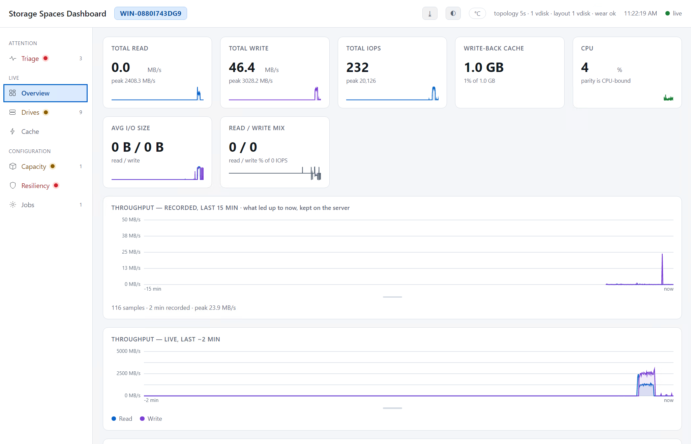
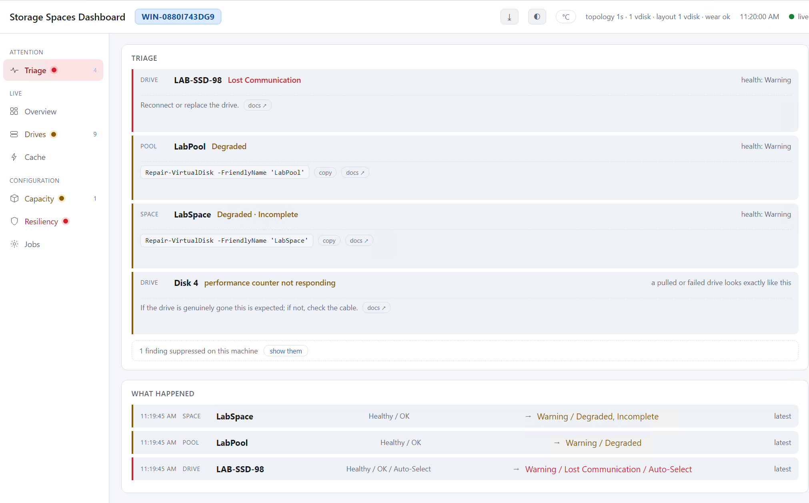
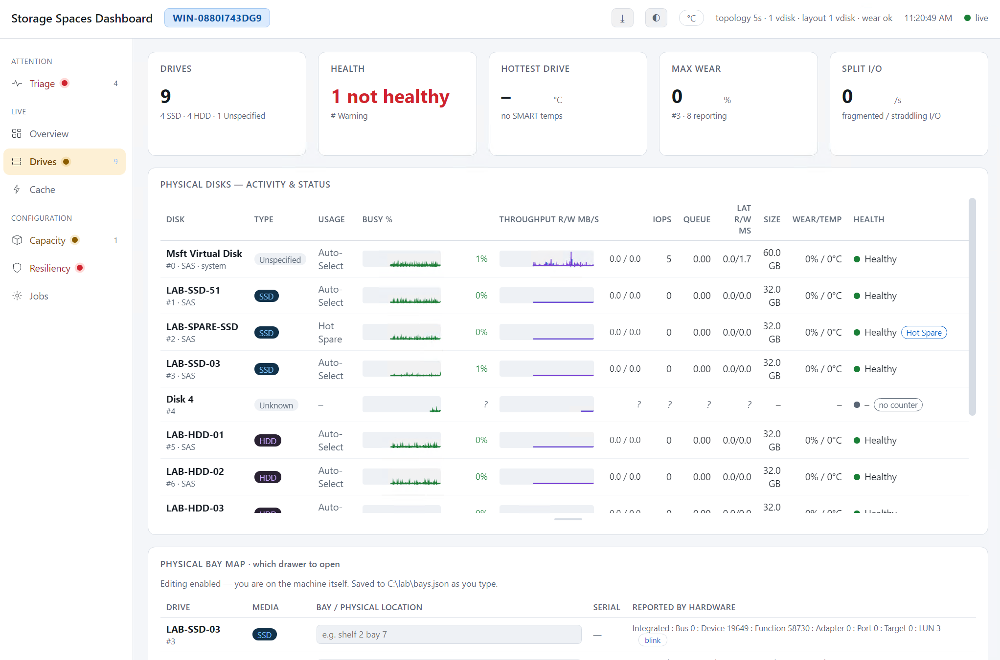
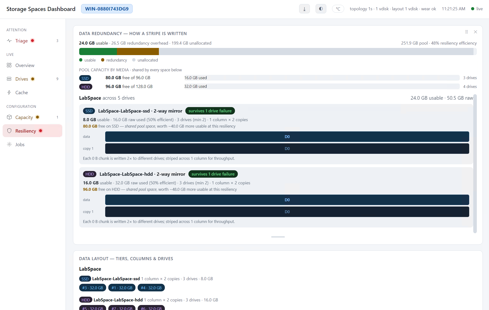

# Storage Spaces Dashboard

A realtime web dashboard for Windows Server storage subsystems, with first-class support for **Storage Spaces** — tiers, resiliency, write-back cache, and repair state.

One self-contained PowerShell script. No modules to install, no runtime to deploy, no agent. Run it, open a browser.

```powershell
.\StorageSpacesDashboard.ps1
```





---

## Why

Windows exposes a great deal about Storage Spaces, but it's scattered across `Get-*` cmdlets that return point-in-time snapshots, and across performance counter sets that the Storage cmdlets don't surface at all. Perfmon can chart the counters but knows nothing about pools, tiers, or resiliency. Server Manager knows the topology but shows no live I/O.

This joins the two: **live per-drive I/O correlated with the Storage Spaces objects those drives belong to.**

## Features

**Triage first**
- A **Triage** view that is *computed, not curated* — it ranks everything wrong across drives, pools, spaces and jobs, worst first, and it only appears in the nav when there is something to say
- **Actionable** — every finding shows the fix: a copyable PowerShell command (`Repair-VirtualDisk`, `Set-StoragePool -IsReadOnly $false`, …) and a link to the exact Microsoft docs page. Commands are copy-only; the dashboard reads the storage stack, it never repairs it
- **What happened**: a server-side timeline of state transitions. During an incident *ordering is causality*, and this survives the page reload you do when something breaks
- **Last 15 minutes**: throughput history recorded on the server since the process started, so opening the dashboard mid-incident gives you a past instead of a blank chart
- **Physical bay map**: which drawer to open. Keyed on the serial number printed on the drive itself, so it survives reboots, re-cabling and moving ports. **Blink** a drive's identify LED to have the hardware point at itself (needs an SES enclosure)
- **Suppress the noise you understand** — mark a finding *not critical* or hide it, per machine. Suppressed findings are never silently dropped: a count is always shown, one click brings them back
- State changes mirrored to the **Windows event log**, so whatever you already run picks them up
- **One-click diagnostic bundle** — topology, timeline, 15-minute history, capacity trend and collector diagnostics as a single JSON file, for the forum post or the ticket

**Tells you *why*, not just *what***
- `OperationalStatus` for drives, pools and virtual disks — *Lost Communication*, *Predictive Failure*, *Degraded*, *Incomplete*, *No redundancy* — the field that names the failure
- **Reason codes**: a pool that is read-only because it *lost quorum* is a catastrophe; one an administrator set is a Tuesday. `ReadOnlyReason`, `DetachedReason` and `CannotPoolReason` are shown with what they mean
- **Peer-relative latency**: a drive several times slower than its own mirror partners is failing, and Windows will call it `Healthy` the whole time
- **Temperature against each drive's own rated maximum**, not a number someone picked
- **SMART's own failure prediction**, which is a different signal from Storage Spaces' — the drive firmware raises it and Spaces does not always surface it
- **ReFS data integrity**: whether the Data Integrity Scan has run, and any corruption ReFS logged
- **Capacity forecast**: days-to-full from the allocation trend, which refuses to answer rather than extrapolate from noise

**Realtime I/O — 100 ms**
- Per-drive **% busy, IOPS, read/write MB/s, queue depth, and read/write latency**
- Every metric is graphed, not just printed — instantaneous values at 100 ms are unreadable, so numbers are smoothed and the sparkline carries full resolution
- **Double-click any graph** to zoom it full-size with axes, gridlines, and now/avg/peak statistics
- Aggregate throughput chart with an auto-scaled MB/s axis and a time axis

**Tier-aware**
- Drives grouped into tiers by media (SCM / SSD / HDD) with live per-tier busy, throughput and IOPS — *is my performance tier absorbing the load, or is it spilling to capacity?*
- **Tier optimisation** panel: data actively moving between tiers, with a 30-minute history, cumulative bytes moved, transfer sizes and latency
- Virtual disks (Spaces) tracked separately from the physical media they sit on, so volume-level I/O isn't double-counted against the drives

**Cache**
- **Storage Spaces write-back cache**: size, used, data vs reclaimable, and cache effectiveness (writes/reads cached vs bypassed) — read straight from the internal counter set
- **Windows file cache**: system cache, standby, dirty pages, available RAM

**Capacity & resiliency**
- Pool allocation, unallocated space, and reconciliation of unpooled drives against the primordial pool
- **Data redundancy** explained: scheme (2-way mirror / dual parity / …), fault tolerance, storage efficiency, minimum drives, and a **stripe diagram** showing how a single stripe is laid out across columns and copies
- **Data layout**: which physical drives back each tier, with column/copy geometry and stripe width
- **Repair & regeneration**: bytes needing regeneration, stale, or missing — degraded data that a `HealthStatus: Healthy` will not tell you about

**Drives**
- Unified table: activity *and* status in one row — busy, throughput, IOPS, queue, latency alongside usage, size, wear, temperature and health
- SMART wear and temperature, with °C/°F toggle
- Health rollup: drive counts by media, hottest drive, max wear, split I/O rate

**Interface**
- Left navigation with **health indicators** — a failed drive is visible from any page
- Every panel can be **closed, reordered by drag, and resized**; layout persists across reloads
- Click a pool or space to **filter** the whole dashboard to its drives
- **Per-panel staleness** — if a collector stalls, the panels it feeds say how old their data is, on the panel, not just in the header. A monitoring tool must never render stale data with a confident face
- **Light / dark / auto** theme, following the OS by default
- **Keyboard-operable** — every control is reachable by tab and arrow keys, for driving it over laggy RDP; WCAG AA contrast in both themes, and animation respects `prefers-reduced-motion`
- Machine name in the header and tab title, for telling servers apart

## Requirements

| | |
|---|---|
| OS | Windows Server / Windows 10+ with the `Storage` module |
| Shell | Windows PowerShell 5.1 or PowerShell 7 |
| Privileges | **Elevated.** Storage Spaces hides pool objects from non-admin callers — silently, with no error |
| Locale | Performance counter names are English (see [Limitations](#limitations)) |
| Browser | Any modern browser |

No installation. No external packages. No outbound network access.

## Usage

```powershell
# Elevated PowerShell
.\StorageSpacesDashboard.ps1
```

Prints a URL and opens your browser:

```
  Storage Spaces Dashboard is live:
    http://localhost:8080/
    realtime 100ms · topology 5s · jobs 5s · wear 300s · layout 300s
  Press Ctrl+C to stop.
```

### Viewing from another machine

```powershell
# once, elevated
netsh http add urlacl url=http://+:8080/ user=Everyone
New-NetFirewallRule -DisplayName "Storage Dashboard" -Direction Inbound -Protocol TCP -LocalPort 8080 -Action Allow

.\StorageSpacesDashboard.ps1 -BindAll
```

> ⚠️ **`-BindAll` has no authentication and no TLS.** It serves your full storage topology — pool names, drive serials, SMART wear, repair state — as plaintext HTTP to anyone who can reach the port. Only use it on a network you trust, or reach the default `localhost` bind over an SSH tunnel / VPN instead. The bay-map and alert-suppression *edits* are always restricted to the local console regardless, but everything is **readable** over `-BindAll`.

### Parameters

| Parameter | Default | Purpose |
|---|---|---|
| `-Port` | `8080` | Listening port |
| `-BindAll` | off | Bind `http://+:port/` for LAN access (needs the urlacl above) |
| `-NoLaunch` | off | Don't open a browser |
| `-SampleMs` | `100` | Disk counter sampling cadence |
| `-PollMs` | `100` | Browser realtime refresh |
| `-SystemMs` | `250` | CPU, file cache, write-back cache, tier movement |
| `-JobsMs` | `5000` | Storage job (repair/rebalance) polling |
| `-TopologyMs` | `5000` | Pools, drives, volumes, capacity |
| `-WearMs` | `300000` | SMART wear/temperature sweep |
| `-LayoutMs` | `300000` | Tier/drive layout |
| `-IncludeWear` | on | Gather SMART wear/temperature |
| `-ExactLayout` | off | Attempt exact per-slab placement (see [Limitations](#limitations)) |
| `-NoEventLog` | off | Don't mirror state changes to the Windows event log |

Lower cadences cost more CPU. Counter reads are cheap (~20 ms for 300 counters), but each cadence also drives JSON serialisation and browser rendering.

### Run it as a daemon (starts at boot)

Optional. Registers a Scheduled Task that runs this same script at every boot, as
SYSTEM, elevated, with no console and no login required — so the dashboard is up
before you are. Deliberately a task and not a Windows service: a service needs a
wrapper like NSSM, and an external dependency would break the one-file rule.

```powershell
# elevated
.\StorageSpacesDashboard.ps1 -Install                 # boot-start, default options
.\StorageSpacesDashboard.ps1 -Install -Port 9000 -BindAll   # options are baked in

.\StorageSpacesDashboard.ps1 -DaemonStatus            # is it installed / running?
.\StorageSpacesDashboard.ps1 -Uninstall               # elevated; stop starting at boot
```

`-Install` prints the access key before it registers anything — once it's running
as SYSTEM there is no console to print it to. Whatever options you pass to
`-Install` are baked into the boot command (`-NoLaunch` is forced; there's no
desktop at boot). The key is **not** regenerated on each boot: it persists in
`key.json`, so your bookmark keeps working.

### Files it writes

The script is the only thing you deploy. At runtime it may create two small files **next to itself**, both optional — absent means the feature is simply inactive:

| File | Written when | Editable |
|---|---|---|
| `bays.json` | you label a drive bay | from the console only (loopback) |
| `alerts.json` | you suppress or downgrade a triage finding | from the console only (loopback) |

They're generated, never deployed. Delete them to reset that state.

## Architecture

The HTTP handler never touches the storage stack. Every collector runs on its own runspace and publishes pre-serialised JSON into shared state; requests are served from that cache. A slow storage call can therefore delay its own feed, but can never stall the dashboard.

| Collector | Cadence | Reads |
|---|---|---|
| Perf | 100 ms | `PhysicalDisk` performance counters; also maintains the 1 Hz throughput history ring |
| System | 250 ms | CPU, memory, Storage Spaces write cache / tier / vdisk counters |
| Jobs | 5 s | `Get-StorageJob` |
| Topology | 5 s | Pools, virtual disks, tiers, volumes, physical disks (with reason codes); diffs state into the event timeline, samples the capacity trend, and (≤5 min) checks ReFS integrity + the Data Integrity Scan |
| Wear | 5 min | `Get-StorageReliabilityCounter` (SMART wear/temp + rated max), plus SMART failure prediction (`MSStorageDriver_FailurePredictStatus`) |
| Layout | 5 min | Tier → drive membership |

All of that history — the throughput ring, the event timeline, the capacity trend — lives **in memory** and dies with the process. No database, no schema, no retention policy, nothing that could itself be the broken thing.

Design notes:

- **Rate counters** are read via `System.Diagnostics.PerformanceCounter`, whose `NextValue()` computes the cooked rate over the interval *between* reads. Unlike `Get-Counter`, there is no 1-second floor — that's what makes 100 ms sampling possible.
- **The topology collector self-limits.** If a scan takes longer than the interval it backs off to the scan duration, capping the storage subsystem at roughly a 50 % duty cycle, and logs that it did so.
- **Shutdown is cooperative.** `Ctrl+C` sets a flag every collector polls; the HTTP loop uses `GetContextAsync` with short timed waits so PowerShell can actually process the interrupt. Collectors are never force-stopped, which would block.
- **Hidden panels don't render.** History is still recorded, but canvases for off-screen or closed panels are skipped, and rows scrolled out of the drive table are culled.

## Troubleshooting

**Nothing appears / "loading" persists**
Check the feed indicator in the header — it shows each collector's freshness. Hover it for the real storage-scan timings on your hardware.

**Pools missing, everything else fine**
Almost always elevation. Storage Spaces returns an empty pool list to non-admin callers rather than an error. Confirm with:
```powershell
Get-StoragePool | Format-Table FriendlyName, IsPrimordial, HealthStatus, Size
```

**Write-back cache or tier panels empty**
Those counter sets are multi-instance and only exist when the relevant feature is configured. Check:
```powershell
(New-Object System.Diagnostics.PerformanceCounterCategory 'Storage Spaces Write Cache').GetInstanceNames()
(New-Object System.Diagnostics.PerformanceCounterCategory 'Storage Spaces Tier').GetInstanceNames()
```

**Disk activity table empty**
Counter names are English. On a non-English Windows build the `\PhysicalDisk(*)\...` paths differ and won't resolve.

**Garbled characters (`·`, `â€"`)**
The script must be saved as **UTF-8 with BOM**. Windows PowerShell 5.1 decodes a BOM-less `.ps1` as ANSI and mangles the symbols.

## Limitations

- **`-ExactLayout` is unusable on large pools.** It relies on `Get-PhysicalExtent`, which returns one row *per slab* — hundreds of thousands of rows on a multi-TB pool, and effectively never returns. It's opt-in, runs behind a hard timeout, and disables itself on failure. The default layout view uses fast CIM associations instead, which shows tier→drive membership and geometry but not per-slab placement.
- **Standalone Storage Spaces.** Not tested against Storage Spaces Direct (S2D) clusters; CSV and cluster-specific counters aren't read.
- **English performance counter names.**
- **Elevation required** for pools and SMART data.
- Editing the script has no effect until the process is **restarted** — the page is served from memory, so a browser refresh will keep serving the old build.

## License

MIT
